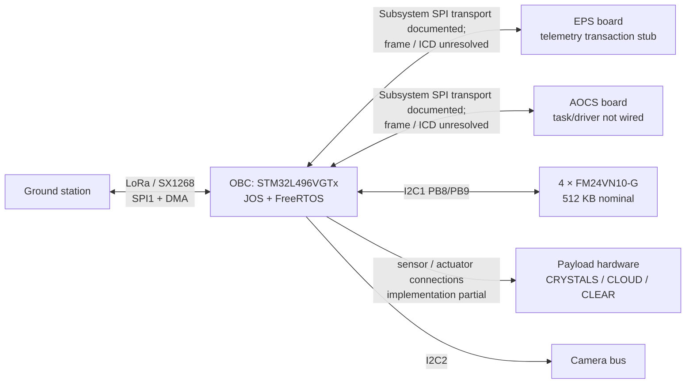
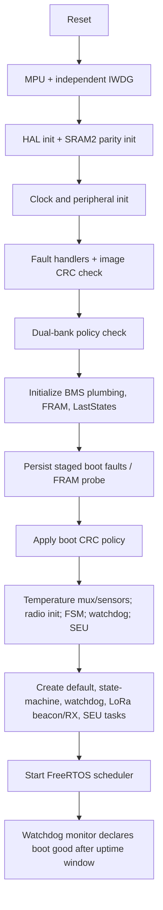
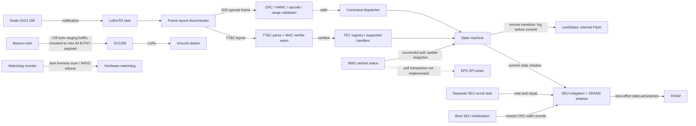

# JOS system architecture

This is a source-tree architecture map, not an approved system baseline. The
SharePoint document set is authoritative as a whole (`AGENTS.md` §1); where it
is unresolved, this document preserves the uncertainty instead of inferring a
flight interface. Source snapshot reviewed: commit `7f0aabd` (2026-09-28).

## System context

The drawing distinguishes transport or board context from a functioning
end-to-end service. EPS/AOCS subsystem SPI frame formats are not specified in
the delivered documents and are not implemented as operational polling
protocols. EPS MCU/gas-gauge identity is an open decision (`TASKS.md`); do not
infer it from this diagram. Payload hardware details and electrical pin
assignments remain subject to the OBC netlist and applicable ICDs.

## Boot and task startup

Sequence is based on `JOS/Core/Src/main.c`. The boot CRC policy can reset on
failure; after its retry budget it continues in an untrusted, constrained mode
as described by `docs/dev/hardening.md`. The golden-image mechanism exists but
is compile-time inhibited because the bank-2 golden vector location conflicts
with the LastStates reservation; it is not an available flight fallback.
`lora_init()`'s return value is not checked at boot. The AOCS, CLOUD, and CLEAR
task factories are not created by `main()` in this snapshot.

## Runtime and fault/data paths

The two uplink layouts are separate code paths (`App/comms/comms.c`). The JOS
opcode path validates CRC and, under the flight default, HMAC-authenticates the
frame before dispatch. The TT&C path parses its distinct layout and rejects
unless its MAC-verifier seam accepts; no replay/freshness check is provided.
Neither diagram nor API name should imply encryption. The beacon's 128-byte
buffer is transmitted as staged, not yet fully populated telemetry, in chunks
because the PHY limit is 64 bytes.

## Operational state model

| State | Name | Source-level meaning |
|---|---|---|
| s0 | OFF | Initial/off state |
| s1 | INIT | Boot initialization state |
| s2 | CRIT | Constrained/critical state |
| s3 | READY | Ready/idle state |
| s4 | ACTIVE | Active operation state |

Transitions are mediated by `App/obsw/state_machine.c`; normal transitions log
to LastStates before state commit. On a log failure `enter_safe_state()` can
force CRIT without a persisted record, prioritizing containment over evidence.
The task loop runs at 10 Hz and attempts a BMS refresh at
1 Hz. A failed BMS poll does not refresh the state-machine snapshot. CRIT
recovery and CRIT→ACTIVE require valid SoC; CRIT→ACTIVE also requires a ground
command. INIT→READY currently assumes antenna
deployment/self-test succeeded, and READY→ACTIVE currently does not enforce a
valid BMS reading. `TRIGGER_TASK_COMPLETE` exists in the type definitions, but
this source snapshot contains no completion transition in the state-machine
implementation. This conflicts with the completed entry in `TASKS.md` for PR #74;
reconcile the discrepancy before relying on s4→s3 task completion.

Do not treat ACTIVE as proof that payload workers are running: the payload and
AOCS task creators are not wired in `main.c`. Payload helper-level actuation
and state interlocks require separate verification; this overview is not an
assurance claim.

## Memory and resilience overview

| Resource | Current documented role | Boundary / caveat |
|---|---|---|
| Internal Flash | Firmware image; LastStates pool at `0x08080000` | Linker reserves application region and LastStates; golden bank fallback inhibited due to address conflict |
| SRAM1 / SRAM2 | RTOS and runtime state; SRAM2 parity-protected critical data | SRAM2 parity init must precede use of protected data |
| External FRAM | Cyclic payload/logging area and SEU golden records | Review exact address ownership before assuming non-overlap or persistence guarantees |
| IWDG + software monitor | Reset backstop and task-liveness supervision | Host doubles do not exercise target suspend/Flash backends |

The memory APIs and protection paths have different semantics: LastStates
logging can veto a state transition; FRAM write-through for committed state is
best-effort; cyclic science writes are not equivalent to protected golden
records. See `docs/api/memory.md`, `docs/dev/seu_mitigation.md`, and
`docs/dev/hardening.md` for contracts and limitations.

## Hardware and unresolved interfaces

- OBC: STM32L496VGTx, Cortex-M4F at 80 MHz; 1 MB internal Flash and 320 KB SRAM.
- Radio: SX1268 on SPI1; SPI transfers use DMA. On-air wiring/pin bring-up still
  has a HIL dependency tracked by `TASKS.md`.
- FRAM: four FM24VN10-G devices on I2C1 (PB8/PB9), nominal 512 KB total.
- EPS/AOCS: subsystem SPI transport is described; request/reply formats remain
  unspecified. EPS processor and battery-monitor identifiers conflict across
  delivered sources; tracked in `TASKS.md` and must not be silently resolved.
- Power management: no mission-level Sleep/Stop implementation is present in
  this snapshot. The radio HAL's WFI is a bounded DMA wait, not low-power mode.
- Flight readiness: CI and host tests do not close radio GPIO HIL, interface
  ICD, or licensing gates recorded in `TASKS.md`.

## Related documentation

- [API contracts](../api/)
- [Build and CI](../dev/building.md), [verification scope](../dev/ci-and-verification.md)
- [Hardening](../dev/hardening.md), [power-mode status](../dev/power_modes.md)
- [Open work and decisions](../../../TASKS.md)
