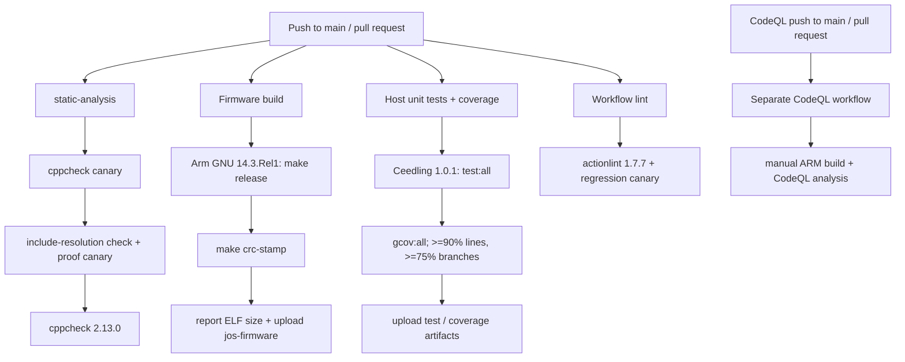

# CI and verification scope

This guide describes what repository checks establish—and what they do not.
It is based on `.github/workflows/build.yml`, `.github/workflows/codeql.yml`,
`JOS/Makefile`, and `JOS/test/project.yml` at the reviewed source snapshot
`7f0aabd` (2026-09-28). Check those files for later changes before relying on
this snapshot as current policy.

## Continuous integration graph

The CodeQL workflow has its own trigger and configuration; inspect its YAML for
the current event conditions. CI success means the configured jobs passed on a
particular commit. It is not a release promotion, signing, flight-qualification,
RF validation, or HIL result. The `jos-firmware` artifact contains ELF, HEX, and
BIN from the build job; the BIN/HEX are CRC-stamped by the explicit CI step.

## Verification matrix

| Evidence | What it checks | What it does not establish |
|---|---|---|
| `make release` | ARM-target compilation/link with the CI toolchain | Runtime correctness, hardware wiring, timing, or flight readiness |
| `make crc-stamp` | Stamps BIN/HEX and verifies the image CRC using the build ELF address | Signing, authenticity, or a complete release process |
| `make cppcheck` and canaries | Configured first-party static-analysis findings and proof the analyzer can reject injected defects | Analysis of all repository-owned sources: `tools/` and `simulation/` are outside this gate. The two App C++ translation units are included by cppcheck, but outside GCC `-fanalyzer` scope |
| `ceedling test:all` | Host tests for configured host-compilable units, often with doubles/fakes | Target HAL behavior, all `Core/Src`, live EPS/AOCS links, or electrical behavior |
| `ceedling gcov:all` | Coverage thresholds for modules in the Ceedling project | Requirements coverage across the full flight system |
| `actionlint` and canary | Workflow syntax/action-input checks and proof the gate catches a known defect | Successful execution of the workflows on GitHub |
| CodeQL | Static security analysis of configured workflow/source scope | HIL, protocol conformance, or complete safety verification |
| ESP32 simulation | Development exercises for the simulation harness | Flight-target HIL or hardware qualification |
| Target HIL / bench | Hardware-specific behavior, only where a defined test/evidence exists | Any untested hardware configurations or unresolved ICD requirements |

Ceedling intentionally excludes `Core/Src` and uses test doubles for target-only
interfaces; inspect `JOS/test/project.yml` for exact source paths. Tests are
useful evidence for their compiled units and contracts, not proof of full-system
integration. Never cite a historical test count as a current run: record the
command, result, commit, and tool versions for each verification claim.

## Open qualification boundaries

- Radio GPIO/pin verification is blocked on the OBC schematic and HIL matrix
  (see `TASKS.md`, issue #54).
- EPS and AOCS interface transports are described, but their wire-level
  contracts are unresolved. Do not invent formats or mark those links verified.
- RedPill-T adapted RadioLib code has a licensing/relicense condition to
  re-verify before flight freeze (`TASKS.md`).
- Green CI and host tests do not close these external/hardware gates.

## Reproduce locally

From the repository root, follow the exact commands and pinned versions in
[`AGENTS.md` §2](../../../AGENTS.md) and
[`building.md`](building.md). For an auditable result, record:

1. Git commit (`git rev-parse HEAD`) and clean/dirty status.
2. Exact command(s) and exit status; do not call an unrun gate green.
3. Tool versions (especially Arm GNU, cppcheck, Ceedling, gcovr, actionlint).
4. Scope exclusions, test doubles, and any unverified target/HIL requirement.
