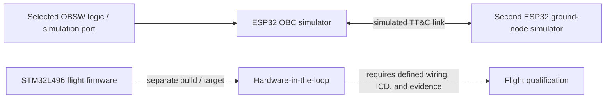

# Simulation and hardware verification

The repository contains an ESP32 dual-board simulation harness under
`simulation/`. It is a development aid for selected OBC/ground interactions; it
is not the STM32 flight target and is not equivalent to radio GPIO HIL or
flight qualification.

## Scope and limits

The ESP32 harness can exercise selected state/command/beacon and simulated
storage paths, depending on the code currently present under `simulation/`.
It does not establish behavior of STM32 HAL, SX1268 electrical wiring, EPS or
AOCS subsystem SPI transactions, payload hardware, target timing, or flight
power modes. Host Ceedling tests are separate; see [CI and verification
scope](ci-and-verification.md).

## Workflow

1. Inspect the current ESP32 harness and its build instructions in
   `simulation/esp32-obc/` before running it; the simulation code is outside the
   firmware gates described in `AGENTS.md`.
2. Record simulator commit, build/run commands, and observed output.
3. Treat discrepancies as findings to investigate; do not use a simulation
   pass to close a hardware or ICD blocker.
4. For actual target HIL, use the acceptance criteria and wiring evidence tied
   to the relevant task/issue. Radio GPIO bring-up remains blocked pending the
   OBC schematic (`TASKS.md`, issue #54).

The STM32 flight build and CRC stamping procedure is in
[`building.md`](building.md).